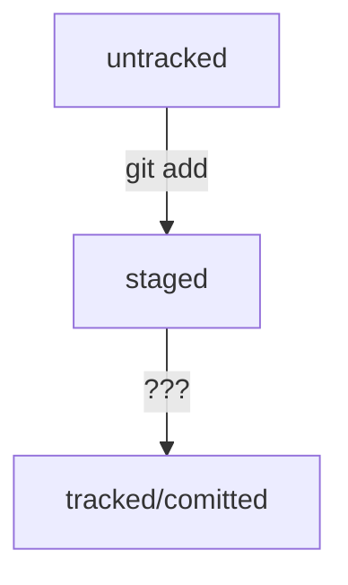

# Хеш коммиты  


Хеш является основным идентификатором коммита (если знаешь хэш - можно узнать все остальное)  


---

# HEAD  


HEAD -  один из служебных файлов папки .git - он указывает на коммит который сделан последним  


1. можно перейти cd .git  


2. затем ls  


3. cat head (будет ссылка) и если заглянуть в эту ссылку - увидим хеш последнего коммита cat refs/  
heads/master - увидим хеш  


# Статусы файлов Git  


1. untracked - неотслеживаемый  


2. staged - подготовленный (после команды git add(такжже называется indexed или cached))  


3. tracked - отслеживаемый (после git commit)  


4. modified - измененный (был заоммичен и после изменен) 





# Оформление сообщений к коммитам  


### Правила оформления коммитов (информативные, в определенном инфинитиве)

  
# Стили оформления  


1. Корпоративный (Jira, указывают Jira-ID, а после текст сообщения)

   
``` git commit -m «LGS-239: Дополнить список пасхалок новыми числами» ```  


2. Conventional Commits  

 
формат <type>: <сообщение> 


type - бывают feat ( для новой функциональности ), fix ( для исправления ошибок )  


``` git commit -m «feat: добавить подсчет суммы» ```  

3. GitHub-стиль  


* #<номер задачи>  


```git commit -m «Исправить #334, добавить график температур»```  


